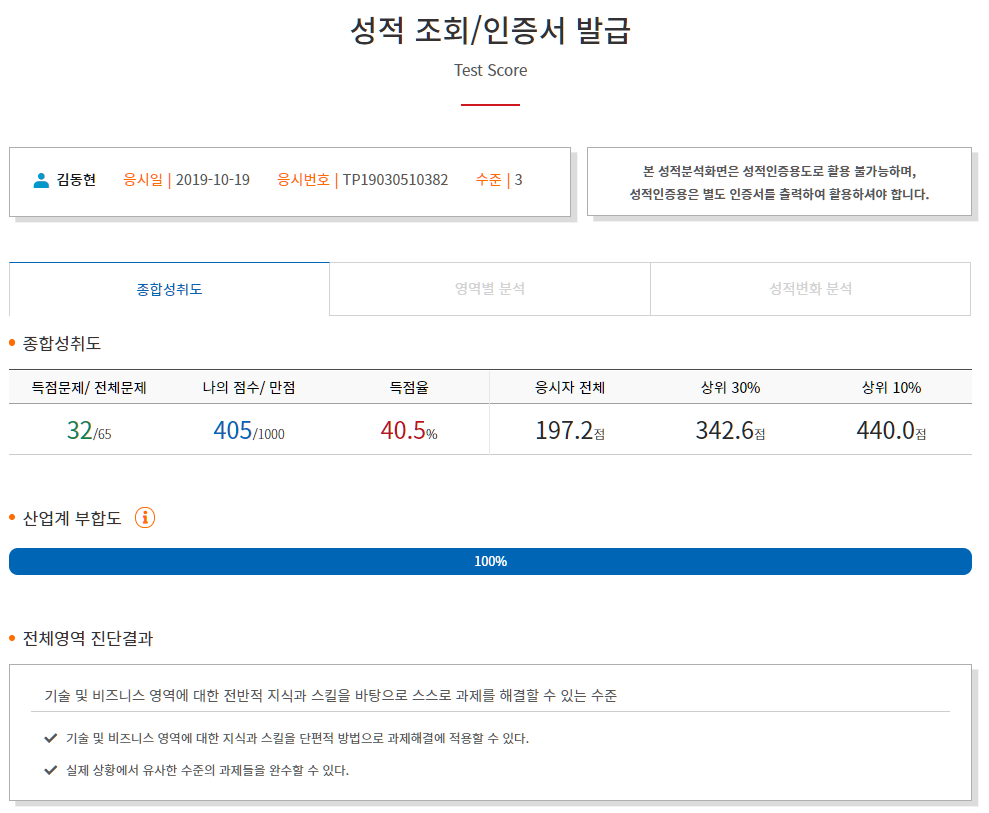
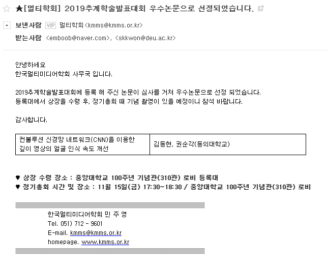

동의대학교 4학년 20153265 김동현 포트폴리오
=============
### 소속 : 컴퓨터소프트웨어공학과 권순각 교수님의 스마트 교통 연구실

###### 2019년 3월 ~

#### 연구 주제
- [AI를 이용한 낙상방지 시스템 제작](https://drive.google.com/file/d/1FvCFugVarFovhI-7CuuYcXfbWZNXSpor/view?usp=sharing)
- 영상 처리를 이용한 차량 번호판 인식 시스템
- CNN을 이용한 얼굴 인식
- 소프트웨어 품질 관리
- git을 이용한 형상관리

#### 봉사활동 및 대외활동
- 2019.3.1 ~ 2020.2.29. 컴퓨터소프트웨어공학과 봉사 동아리 회장 활동 및 SW 코딩 교육 봉사활동 50시간 이상

#### 수상경력
- 2019.10.19 TOPCIT 405점

- 2019.11.15 2019 멀티미디어학회 추계학술발표대회 우수논문

- 2019.11.30 KSIIS 전국 캡스톤 디자인 경진대회 우수상

#### 자격증
- 정보처리기사 취득중(현재 필기 합격)

#### 경험
- 언어: C,C++, java, python, html, css, js, jsp, sql
- 운영체제: Windows, Linux, mac OS
- 임베디드: Arduino Uno, Erle-brain, Raspberry PI
- 기타: 안드로이드, OpenGL, 자료구조 
- 백엔드: flask

#### 프로젝트 개발 목록
* C
	* [MoveMove](https://github.com/emboob/DB-TeamProject)
		* 여행 중 영화 및 드라마 소개 시스템
	* [Shell](https://github.com/emboob/SP-Shell)
		* 팀원과 협동하여 개인이 제작한 쉘 만들기
	* [Chatting](https://github.com/emboob/SP-Chat)
		* C언어로 GUI를 이용한 채팅기능 구현
		
		
* JAVA
	* [SearchMyPokemon](https://github.com/emboob/SW-DesignEngineering)
		* 사용자별 포켓몬 추천 시스템 및 포켓몬 이상형 월드컵
	*	[ROS](https://github.com/emboob/Object-oriented-modeling)
		* ROS를 이용하여 미로탈출 및 주행시험장 주행

* Python
	*	[ROS](https://github.com/emboob/Object-oriented-modeling)
		* ROS를 이용하여 미로탈출 및 주행시험장 주행
	* [Smart Umbrella Stand](https://github.com/emboob/embedded_TeamProject)
		* 날씨 알림 기능이 있는 스마트 우산꽂이
		
		
* Android
	*	[DayLight](https://github.com/emboob/Android)
		*	D-Day, Reminder, Alarm, Gift Recommend 기능을 가진 안드로이드 일정 관리 어플리케이션

* HTML&CSS&JAVAScript
	* [동의대학교 학생 웹 게시판](https://github.com/emboob/Internet-Programming)
		* 동의대학교 학생 웹 게시판 제작 및 파이어베이스 호스팅

